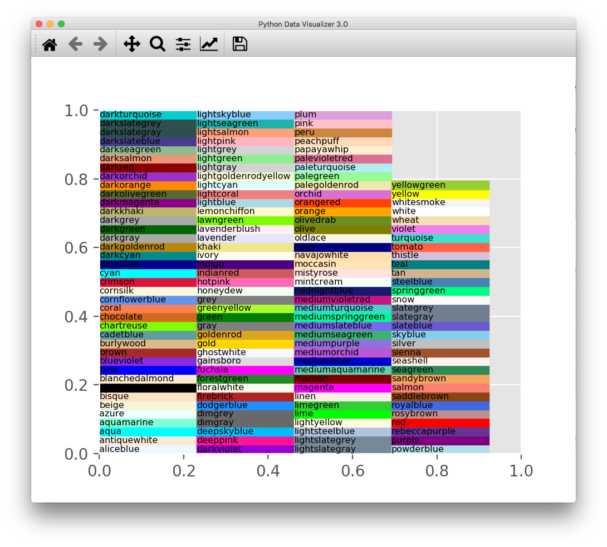
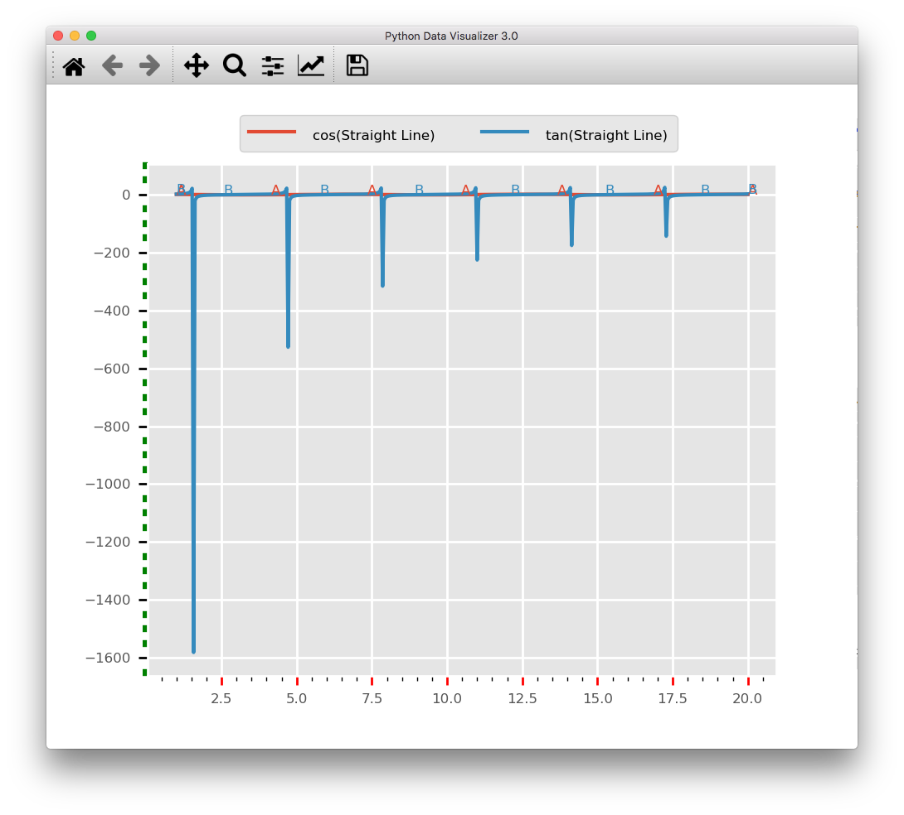
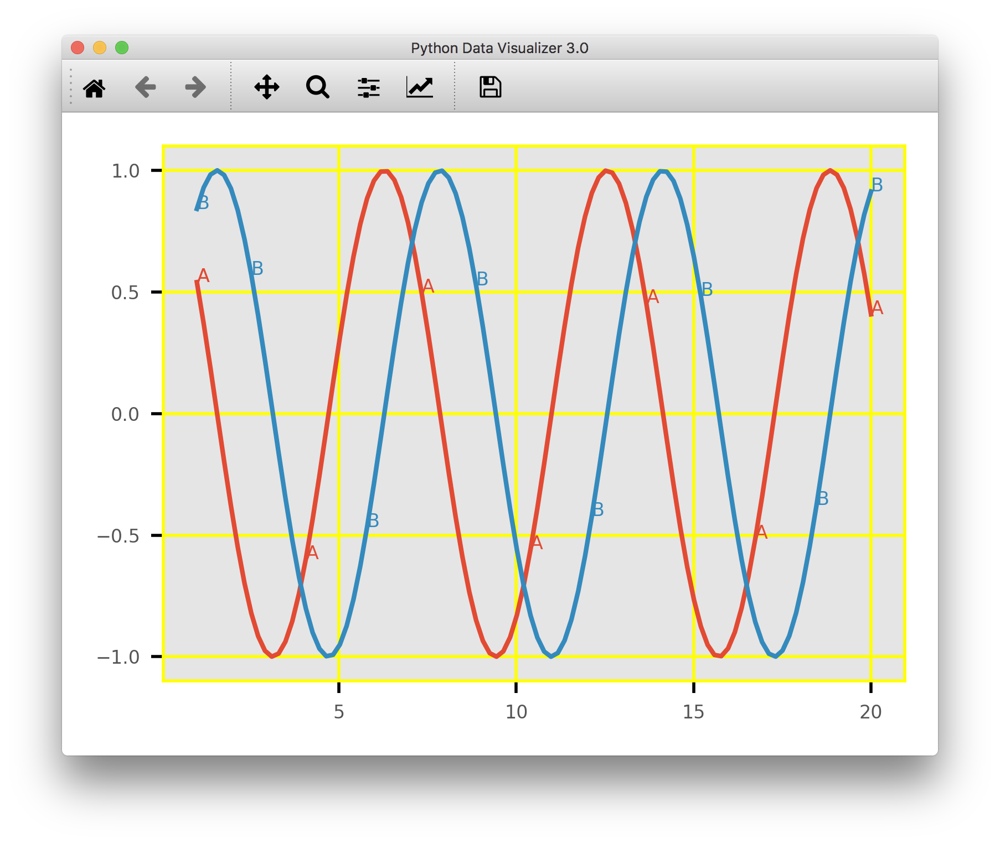
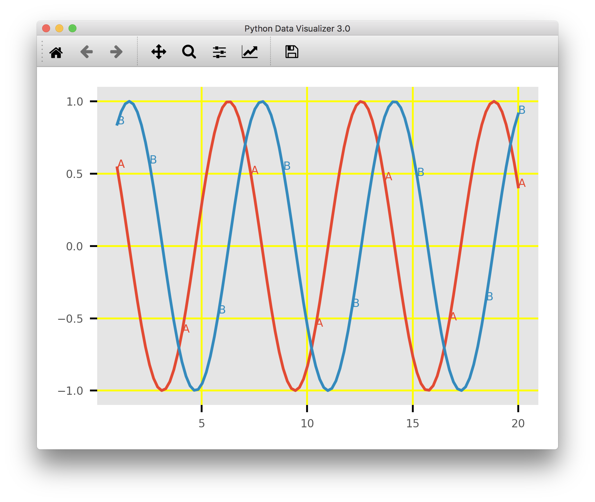

.. _ui_features:

UI Features
===========

The PyDV User Interface (UI) has many different windows and toolbar items that provide information and alternative ways of executing PyDV commands (see :numref:`Figure %s<pydv>`). Below is a description of the different UI components that are available.

.. _pydv:
   
.. figure:: images/pydv.png
   :scale: 40%

   PyDV User Interface

Toolbar
-------

An annotated toolbar for the PyDV UI is shown in :numref:`Figure %s<toolbar>`. Button **1** allows the user to reset the plot window to the original view, button **2** allows the user to step back to the previous view, and button **3** allows the user to step through to the next view. Button **4** allows panning the axis with the left mouse button and zooming the axis with the right mouse button. Button **5** allows zooming to a rectangle. Button **6** allows configuring of the subplots, button **7** is for saving the displayed figure, and button **8** is for editing curve lines and axes parameters. The area highlighted in **9** tracks the mouse location over the plot.  

.. _toolbar:

.. figure:: images/toolbar.png
   :scale: 50%

   UI Toolbar

Help Menu
---------

The **Help** menu contains three items for displaying information to the user. The **Copyright ...** menu item displays the copyright information for PyDV (see :numref:`Figure %s<copyright>`). The **About PyDV** window, :numref:`Figure %s<about_1>`, displays information about the current release of PyDV and provides developer contact information. The **About Qt** window, :numref:`Figure %s<about_2>`, displays information about the *Qt* version that PyDV is using.

.. _copyright:

.. figure:: images/copyright.png
   :scale: 50%

   PyDV Copyright

.. _about_1:

.. figure:: images/about1.png
   :scale: 50%

   About PyDV Window

.. _about_2:
   
.. figure:: images/about2.png
   :scale: 50%

   About Qt Window

View Menu
---------

The **View** menu contains the **List** and **Menu** dialogs. The **List** dialog displays the information from the **list** command and also allows the user to deleted selected curves from the plot window (see :numref:`Figure %s<list>`).

.. _list:

.. figure:: images/list.png
   :scale: 50%

   List of plotted curves

The **Menu** dialog lists the available curves read from a file. The user can delete or plot curves from this dialog (see :numref:`Figure %s<menu>`). 

.. _menu:

.. figure:: images/menu.png
   :scale: 50%

   List of available curves

PyDV Colormap
-------------

You can display the available colors to use in PyDV for commands like **xtickcolor** by using the **showcolormap** command.

.. _colormap:

   Display of the available colors to use in PyDV

.. code::

   [PyDV]: showcolormap

Plot Tickmarks
--------------

The plot tickmarks can be modified as desired. You can change the width, length, color, and number. Below is an example of changing the x-axis major tickmarks to red, the y-axis minor tickmarks to green, and the width of the y-axis minor tickmarks. The corresponding PyDV commands are also shown below.

.. _ticks:

   Example of modifying the plot tickmarks

.. code::

   [PyDV]: minorticks on
   [PyDV]: xtickcolor red major
   [PyDV]: ytickcolor green minor
   [PyDV]: ytickwidth 3 minor

Border
------

The border that outlines the plot can be shown or hidden. You can also change the color of the border line. Below is an example of showing and hiding the border and also setting its color to yellow.

.. _borderon:

   Plot with yellow border and yellow grid

.. code::
  
    [PyDV]: span 1 20
    [PyDV]: span 1 20
    [PyDV]: cos a
    [PyDV]: sin b
    [PyDV]: gridcolor yellow
    [PyDV]: border on yellow

.. _borderoff:

   Plot with yellow border hidden

.. code:: 

   [PyDV]: border off
